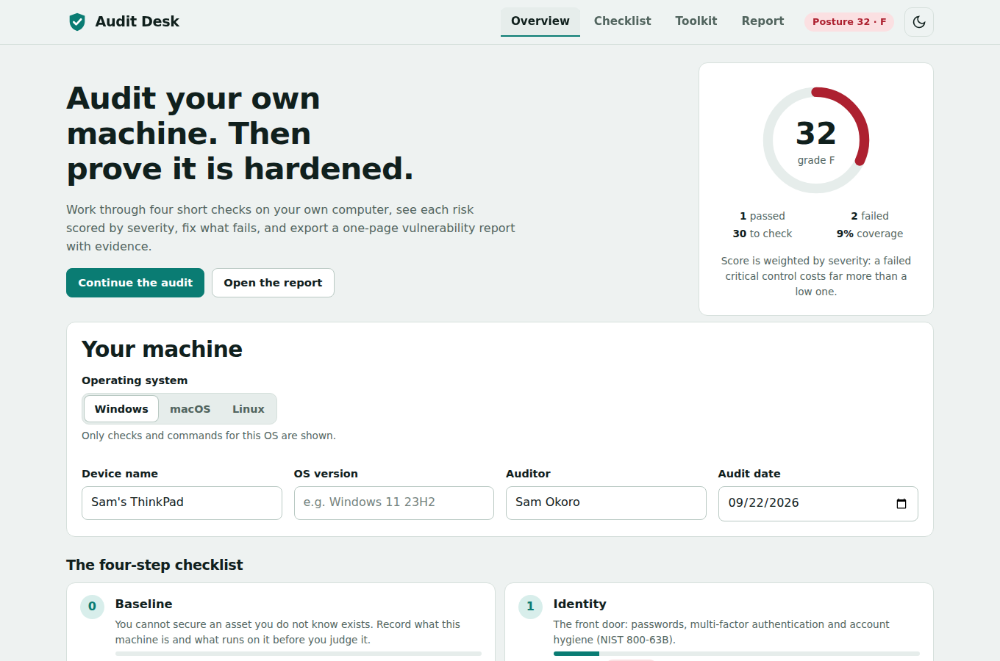
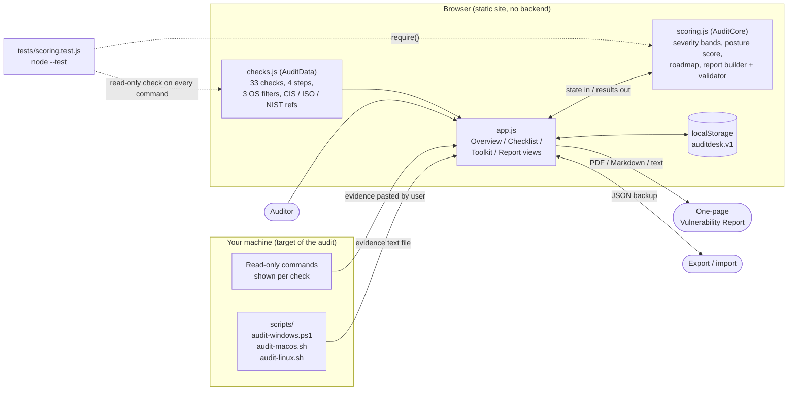
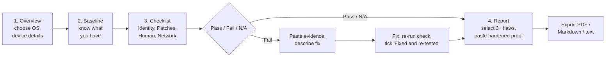

<div align="center">

#PROJECT 4 BY DECODE LABS 🛡️ Audit Desk

**An interactive system vulnerability checklist with severity-weighted risk scoring and a one-page report generator.**
Audit your own computer, prove the fix, and export a submission-ready report.

[](https://shadow-exe64.github.io/audit-desk/)
[](https://github.com/Shadow-Exe64/audit-desk/actions)
[](LICENSE)


** System Vulnerability Checklist** ·



</div>

---

## Table of contents

- [Overview](#overview)
- [Architecture](#architecture)
- [Features](#features)
- [Requirements to implementation map](#requirements-to-implementation-map)
- [Quick start](#quick-start)
- [How scoring works](#how-scoring-works)
- [Using it for real](#using-it-for-real)
- [Security and privacy design](#security-and-privacy-design)
- [Testing](#testing)
- [Project structure](#project-structure)
- [Deployment](#deployment)
- [Roadmap](#roadmap)
- [License](#license)

## Overview

Audit Desk walks you through a **33-point checklist** across four steps (identity, patches, human perimeter, network), scores each failed control on the **CVSS qualitative scale**, and generates a **one-page Vulnerability Report** with diagnosis, remediation and proof.

It is a static, local-first web app. Evidence comes from read-only commands or from one-click collector scripts, and everything you enter stays in your browser.

> **Only audit machines you own or are explicitly authorised to assess.**

## Architecture

The app is split into three layers: **data** (the checklist), **logic** (scoring and report building, no DOM) and **UI**. The logic layer is a UMD module, so the browser and the Node test runner use the same code.



### Audit workflow



### Design decisions

| Decision | Reason |
| --- | --- |
| Data, logic and UI in separate files | `checks.js` is data only, `scoring.js` is pure functions, so both are unit-testable without a browser. |
| Read-only commands enforced by a test | `tests/scoring.test.js` scans every command for destructive verbs, so the tool cannot be the cause of an incident. |
| Severity-weighted score | Failing a Critical control costs far more than failing a Low one, so the number reflects real priority. |
| Local-first storage | State lives in `localStorage` with JSON export/import. Nothing is uploaded. |
| Static hosting | GitHub Pages serves it. No server to secure. |

## Features

- **33 checks, 3 operating systems.** Windows, macOS and Linux each get only the checks and commands that apply to them (for example macOS stealth mode, Windows SMBv1).
- **Explainable severity.** Each finding shows an indicative CVSS-style score and band (Critical 9.0–10 → Low 0.1–3.9), a why-it-matters explanation, and a CIS Controls v8 / ISO 27001:2022 / NIST mapping. Nudge severity ±1 for your own context, such as a shared vs personal machine.
- **Read-only by design.** Every command shown or downloaded only *reads* system state. Nothing is changed, installed or uninstalled.
- **One-click evidence collectors.** `audit-windows.ps1`, `audit-macos.sh` and `audit-linux.sh` run the whole matrix for one OS and save a text file to paste from.
- **Severity-weighted posture score** shown *before* and *after* remediation, with a letter grade.
- **One-page report.** Select at least three flaws, describe the fix, paste proof of the hardened state, and export as PDF, Markdown or plain text. A submission checklist confirms the deliverable rules are met.
- **Local-first.** Saved in your browser. Export or import a JSON backup, or reset at any time.
- Light and dark theme, keyboard-accessible tabs, responsive layout.

## Requirements to implementation map

| Requirement from the brief | Implemented in |
| --- | --- |
| Create a checklist to identify basic security vulnerabilities | **Checklist** tab: 33 checks across Identity, Patches, Human, Network |
| Check weak passwords | Identity step: unique passwords, password manager, breach exposure, default or blank credentials |
| Check software update status | Patches step: OS updates, browser, anti-malware, third-party apps, firmware, EOL OS |
| Identify unsafe user practices | Human step: screen lock, guest account, least privilege, plaintext credentials, USB, phishing habits |
| Perform the 4-step checklist on your own computer | **Toolkit** tab: read-only command matrix plus evidence-collector scripts for Windows, macOS and Linux |
| CVSS-style risk categorisation | Every check carries an indicative severity (Critical / High / Medium / Low), adjustable per context |
| One-page Vulnerability Report: flaws, remediation, hardened proof | **Report** tab: Sections 1–3 as specified, submission checklist, PDF export |

## Quick start

No build step and no dependencies.

```bash
git clone https://github.com/Shadow-Exe64/audit-desk.git
cd audit-desk
npm start        # serves http://localhost:8080  (or: python3 -m http.server 8080)
```

To run a collector script on the machine you are auditing:

```bash
# Linux
bash scripts/audit-linux.sh
# macOS
bash scripts/audit-macos.sh
# Windows (PowerShell)
powershell -ExecutionPolicy Bypass -File scripts\audit-windows.ps1
```

Read a script before you run it. They only read system state.

## How scoring works

Each check has an indicative severity (0.1–10) mapped to the CVSS qualitative scale:

| Score | Band | Suggested timeline |
| --- | --- | --- |
| 9.0 – 10.0 | Critical | Fix now |
| 7.0 – 8.9 | High | This week |
| 4.0 – 6.9 | Medium | This month |
| 0.1 – 3.9 | Low | Backlog |

The **posture score** is the severity-weighted share of passing checks among the ones you have assessed. N/A and unanswered checks are excluded. Remediated failures move the score from *before* to *after* without a full re-audit.

| Posture (after) | Grade |
| --- | --- |
| 90+ | A |
| 80–89 | B |
| 70–79 | C |
| 60–69 | D |
| below 60 | F |

**These are indicative ratings, not calculated CVSS vectors.** Real CVSS uses attack vector, complexity, privileges and more (see [first.org/cvss](https://www.first.org/cvss/)). Treat the numbers as a teaching approximation for prioritisation.

## Using it for real

1. Go to **Overview**, choose your OS and fill in the device details.
2. Work through **Baseline**, then **Checklist** step by step. Use the command shown, or the matching script in **Toolkit**, to get real evidence. Do not guess.
3. Mark each check Pass / Fail / N/A. For a Fail, paste the evidence and describe the fix, then tick "Fixed and re-tested" once you have re-run the check.
4. Open **Report**, pick at least three flaws, paste your final verification output, and export as PDF.

## Security and privacy design

- Runs entirely in your browser. Nothing is uploaded.
- All displayed and downloaded commands are read-only, enforced by an automated test.
- Imported JSON backups are sanitised before use.
- Report output escapes Markdown and table pipes.

## Testing

```bash
npm test         # Node 18+, uses the built-in test runner
```

14 tests cover the CVSS band boundaries, data integrity (every check has a valid step, OS list, score and references), **that every shown command is read-only**, severity-weighted scoring (including N/A handling and before/after remediation), OS filtering, and the report generator (validation rules, Markdown escaping, table pipes, custom selection). CI runs them on every push and pull request.

## Project structure

```
.
├── index.html
├── assets/
│   ├── css/
│   │   ├── base.css
│   │   └── styles.css
│   └── js/
│       ├── checks.js       # the 33-item checklist + command matrix (data only)
│       ├── scoring.js      # severity, posture score, report builder (pure logic)
│       └── app.js          # UI: overview, checklist, toolkit, report
├── scripts/
│   ├── audit-windows.ps1   # read-only PowerShell evidence collector
│   ├── audit-macos.sh      # read-only Bash evidence collector
│   └── audit-linux.sh      # read-only Bash evidence collector
├── tests/scoring.test.js
├── docs/screenshot.png
└── .github/workflows/pages.yml
```


## License

MIT. See [LICENSE](LICENSE).
